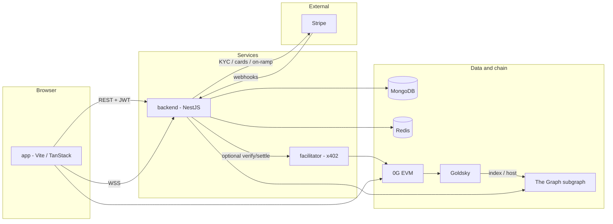

# Beam

Monorepo for **Beam** — an agentic finance workspace on **0G**: marketplace, chat with hired agents, treasury flows, and chain-backed settlement (including [x402](https://docs.x402.org/) payment verification via a dedicated facilitator service).

This repository contains:

| Path | Role |
|------|------|
| [`app/`](app/) | Web client (React 19, TanStack Start / Router, Vite, Wagmi, Tailwind) |
| [`backend/`](backend/) | **Stardorm** NestJS API — auth, users, agents, payments, Stripe/KYC, 0G compute/storage hooks, subgraph-backed catalog |
| [`facilitator/`](facilitator/) | Small NestJS **x402 facilitator** — HTTP `verify` / `settle` / `supported` for EVM exact payments on 0G |
| [`packages/stardorm-api-contract/`](packages/stardorm-api-contract/) | Shared Zod schemas and API types consumed by `app` and `backend` |
| [`smart-contracts/`](smart-contracts/) | Hardhat / on-chain work and subgraph config (see that folder’s README) |

Product positioning and narrative live in [`deck.md`](deck.md).

---

## Overview

### Architecture (high level)



- The **app** talks to the **backend** (`VITE_STARDORM_API_URL`) for wallet auth, conversations, handlers, and payment APIs. It can read on-chain/agent catalog data from a **subgraph** when `VITE_STARDORM_SUBGRAPH_URL` is set (often a **Goldsky**-hosted GraphQL endpoint; see [`smart-contracts/subgraph/`](smart-contracts/subgraph/)).
- The **backend** persists state in **MongoDB**, may call **0G** RPCs and SDKs for compute/storage, calls **Stripe** for KYC, card funding, and on-ramp flows (with **webhooks** back into the API), and calls the **facilitator** when `X402_FACILITATOR_URL` is set and a checkout uses facilitator settlement.
- The **facilitator** holds an EVM private key and uses `@x402/core` + `@x402/evm` to verify and settle payments on the configured 0G network.

### Default ports (local)

| Service | Port | Notes |
|---------|------|--------|
| Backend (`PORT`) | `3000` | Nest default in code / compose |
| Facilitator (`PORT`) | `3402` | Nest default in code / compose |
| Redis (Docker host mapping) | `6378` → container `6379` | Declared in compose for future or multi-instance use |
| App (Vite) | Vite default (often `5173`) | Set in terminal when you run `pnpm dev` |

---

## Backend developer guide

### Prerequisites

- **Node.js** (LTS 20+ recommended; align with your team’s version)
- **pnpm** (`corepack enable` or `npm i -g pnpm`)
- **MongoDB** reachable at `MONGODB_URI`

### First-time setup

```bash
cd packages/stardorm-api-contract
pnpm install
pnpm build

cd ../../backend
cp .env.example .env
# Edit .env — at minimum MONGODB_URI, JWT_SECRET, CORS_ORIGINS, and URLs below.

pnpm install
```

For **x402 facilitator settlement** from the API, set `X402_FACILITATOR_URL` to a running facilitator (e.g. `http://localhost:3402` locally, or `http://facilitator:3402` inside Docker).

### Run

```bash
cd backend
pnpm run start:dev    # watch mode
# pnpm run start      # single run
# pnpm run start:prod # after pnpm run build
```

### Useful scripts

| Script | Purpose |
|--------|---------|
| `pnpm run build` | Nest compile to `dist/` |
| `pnpm run lint` | ESLint |
| `pnpm run test` | Jest unit tests |
| `pnpm run test:e2e` | E2E tests (`test/jest-e2e.json`) |

### Where to look in the code

- **HTTP surface**: `src/*/*.controller.ts`, `src/app.controller.ts`
- **Auth / JWT**: `src/auth/`
- **Payments + facilitator client**: `src/payments/` (e.g. `x402-facilitator.service.ts`, `payment-requests.service.ts`)
- **Agent tools / handler payloads**: `src/agent-reply/`, `src/handlers/`
- **Stripe / KYC / on-ramp**: `src/stripe/`
- **Mongo models**: `src/mongo/schemas/`
- **Subgraph**: `src/subgraph/`
- **0G compute / storage**: `src/og/`, `src/storage/`

### Contract package changes

If you change `packages/stardorm-api-contract`, rebuild it (`pnpm run build` in that package) so TypeScript and runtime consumers in `backend` pick up new types and bundled output.

---

## Frontend developer guide

### Prerequisites

- **Node.js** + **pnpm**
- Built **`@beam/stardorm-api-contract`** (same as backend) if you rely on `dist/` from `node_modules`; the Vite config also aliases the package to the **source tree** for dev resolution — keep the package in sync when editing shared schemas.

### First-time setup

```bash
cd packages/stardorm-api-contract
pnpm install
pnpm build

cd ../../app
cp .env.example .env
# Set VITE_STARDORM_API_URL to your backend (e.g. http://localhost:3000)

pnpm install
```

### Run

```bash
cd app
pnpm dev
```

### Build and preview

```bash
pnpm run build
pnpm run preview
```

### Lint / format

```bash
pnpm run lint
pnpm run format
```

### Stack notes

- **Routing**: TanStack Router under `src/routes/`
- **Wallet**: Wagmi + Reown AppKit (`VITE_REOWN_PROJECT_ID` when using WalletConnect)
- **Server API URL**: `VITE_STARDORM_API_URL` (see [Environment variables](#environment-variables))

---

## Facilitator developer guide

The **facilitator** is a minimal NestJS app that exposes the x402 facilitator HTTP API used by the backend’s `HTTPFacilitatorClient` flow (`verify`, `settle`, `supported`).

### Prerequisites

- **Node.js**
- **npm** (this package ships `package-lock.json`; Docker build uses `npm ci`)

### First-time setup

```bash
cd facilitator
cp .env.example .env
# Required: PRIVATE_KEY (0x-prefixed), X402_EVM_NETWORK (eip155:16661 or eip155:16602)

npm install
```

### Run

```bash
npm run start:dev
# npm run start:prod  # after npm run build
```

### Configuration

- **`PRIVATE_KEY`**: EVM key for the facilitator signer (must fund gas on 0G).
- **`X402_EVM_NETWORK`**: CAIP-2 id — `eip155:16661` (0G mainnet) or `eip155:16602` (0G testnet). Unsupported values throw at startup (`beam-chain.config.ts`).
- **`OG_RPC_URL`**: optional JSON-RPC override; otherwise the chain’s default HTTP RPC is used.
- **`PORT`**: listen port (default `3402`).

### HTTP API (summary)

| Method | Path | Purpose |
|--------|------|---------|
| `GET` | `/verify`, `/settle` | JSON description of POST bodies |
| `POST` | `/verify` | Verify a payment payload against requirements |
| `POST` | `/settle` | Settle on-chain |
| `GET` | `/supported` | Supported schemes / networks |

### Production image

See [`facilitator/Dockerfile`](facilitator/Dockerfile): multi-stage Node 22 Alpine build, `npm ci`, `nest build`, production `node dist/main`.

---

## Docker: backend and facilitator

[`docker-compose.yml`](docker-compose.yml) defines three services:

1. **`facilitator`** — build context `./facilitator`, image built from `facilitator/Dockerfile`, env from `./facilitator/.env`, exposes **3402**.
2. **`backend`** — build context `./backend`, depends on `facilitator` and `redis`, env from `./backend/.env`, injects `X402_FACILITATOR_URL=http://facilitator:3402` and `REDIS_URL=redis://redis:6379`, exposes **3000**.
3. **`redis`** — `redis:7-alpine`, host port **6378** mapped to container **6379**, AOF volume `redis_data`.

### Before you compose

1. Copy env files (compose uses **`.env`**, not `.env.example`):
   - `facilitator/.env` from [`facilitator/.env.example`](facilitator/.env.example)
   - `backend/.env` from [`backend/.env.example`](backend/.env.example) — must include everything the Nest app needs at runtime (MongoDB, JWT, etc.). Compose **overrides** `PORT`, `X402_FACILITATOR_URL`, and `REDIS_URL` for in-network URLs.

2. **Backend image**: the compose file expects a **`Dockerfile` under `backend/`**. This repository currently includes a production **`Dockerfile` only under `facilitator/`**. If `docker compose build backend` fails with a missing Dockerfile, either:
   - add a `backend/Dockerfile` (multi-stage pattern similar to the facilitator, using **pnpm** and `pnpm run build` / `node dist/main`), or  
   - run Redis + facilitator with Compose and run the **backend on the host** with `X402_FACILITATOR_URL=http://localhost:3402` and `REDIS_URL=redis://localhost:6378`.

### Commands

```bash
# From repository root
docker compose build
docker compose up
```

After `up`, from the host machine: backend at `http://localhost:3000`, facilitator at `http://localhost:3402`, Redis at `localhost:6378`.

---

## Environment variables

Canonical templates live next to each app:

| File | Consumer |
|------|----------|
| [`backend/.env.example`](backend/.env.example) | Nest API — copy to `backend/.env` |
| [`app/.env.example`](app/.env.example) | Vite — copy to `app/.env` (only `VITE_*` are exposed to the browser) |
| [`facilitator/.env.example`](facilitator/.env.example) | Facilitator — copy to `facilitator/.env` |

### Backend (`backend/.env`) — grouped by concern

- **Core**: `MONGODB_URI`, `JWT_SECRET`, `PORT`, `CORS_ORIGINS` (comma-separated origin prefixes; `*` allows any origin in dev — see comments in `.env.example`)
- **x402**: `X402_FACILITATOR_URL` (base URL of facilitator HTTP API)
- **Indexing / chain**: `STARDORM_SUBGRAPH_URL`, optional `STARDORM_SUBGRAPH_URL_MAINNET` / `_TESTNET`, `X-Beam-Chain-Id` behavior per `.env.example`
- **0G / EVM RPCs**: `PRIVATE_KEY`, `OG_RPC_URL_MAINNET`, `OG_RPC_URL_TESTNET`, `ONRAMP_RPC_*`, `OG_STORAGE_INDEXER_RPC`, etc.
- **Chainscan / tax helpers**: `CHAINSCAN_API_URL`, tier overrides, optional `CHAINSCAN_TAX_USD_PER_NATIVE`
- **Stripe / KYC / webhooks**: `STRIPE_SECRET_KEY`, `STRIPE_WEBHOOK_SECRET`, `APP_PUBLIC_URL`
- **Virtual card / treasury** (when features enabled): `CREDIT_CARD_FUND_RECIPIENT`, `CREDIT_CARD_TREASURY_PRIVATE_KEY`, `ONRAMP_TREASURY_PRIVATE_KEY`
- **Inference**: `INFERENCE_USE_RESPONSES_API`

Details and event names for Stripe webhooks are documented inline in [`backend/.env.example`](backend/.env.example).

### Frontend (`app/.env`)

- **`VITE_STARDORM_API_URL`**: Backend origin (e.g. `http://localhost:3000`)
- **`VITE_STARDORM_SUBGRAPH_URL`**: Optional GraphQL HTTP endpoint for marketplace / on-chain data
- **Optional**: payment token decimals, 0G registry contract addresses, `VITE_REOWN_PROJECT_ID`

### Facilitator (`facilitator/.env`)

- **`PRIVATE_KEY`**: Required — facilitator signer
- **`X402_EVM_NETWORK`**: Required — `eip155:16661` or `eip155:16602`
- **`OG_RPC_URL`**, **`PORT`**: Optional overrides

---

## Related docs

- [`smart-contracts/README.md`](smart-contracts/README.md) — Hardhat / contracts / tests
- [`deck.md`](deck.md) — product narrative
