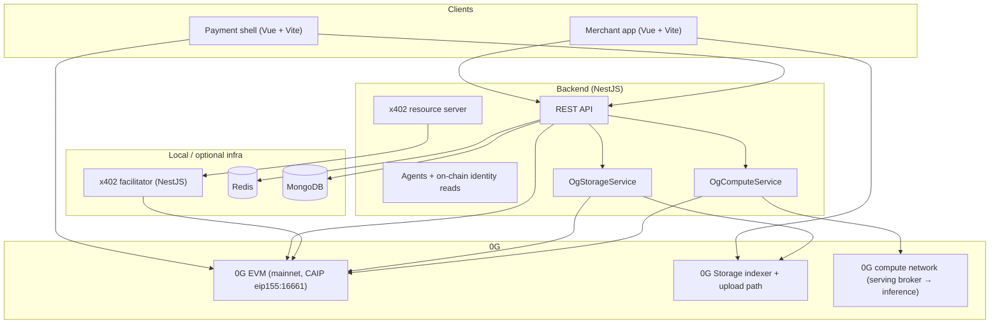

# Beam — Track 3: Agentic Economy & Autonomous Applications

Submission README (English) for judges: **project overview**, **architecture**, **0G modules**, **how they support the product**, **local reproduction**, and **reviewer notes**.

---

## 1. Project overview

**Beam** is a payment and access rail for humans, merchants, and autonomous software. It combines **on-chain settlement** on **0G** (one-time payments, recurrent billing, multi-payer splits, merchant identity) with **HTTP 402 / x402** so APIs and files can require **micropayments** before access. Merchants get **QR checkout**, **split bills**, and **deployable sales agents** that return structured payment intents. Heavy or sensitive payloads are kept **off-chain** on **0G Storage** (content-addressed by root hash); agent chat can use **0G compute** (inference via the serving broker, with optional response verification).

This aligns with **Track 3** — the **financial and service layer for the AI era**: programmable money movement, agent-native commerce, and decentralized delivery of paid resources.

---

## 2. System architecture

### 2.1 Diagram



### 2.2 Technical description (short)

| Layer | Role |
|--------|------|
| **Smart contracts** | Beam payment and identity contracts on **0G** EVM; addresses exposed via `@railbeam/beam-ts` / SDK constants. |
| **Backend** | NestJS: auth, transactions, **x402** resources (encrypt metadata, upload blobs), **agents** (chat, encrypted config on 0G Storage), **GET /storage/:rootHash** proxy for downloads. |
| **Facilitator** | Separate Nest service using `@x402/core` + `@x402/evm` with **viem** on **`zeroGMainnet`** — verifies and settles x402 payments. |
| **App (`app/`)** | Merchant dashboard: wallet, catalog, x402 resources, optional **browser uploads** to 0G Storage via `@0gfoundation/0g-ts-sdk`. |
| **Pay (`pay/`)** | Customer / agent payment UI: wagmi on 0G, Beam SDK, x402 client flows. |
| **Indexing** | Subgraph / Goldsky URL configurable in SDK (`sdk/src/utils/endpoints.ts`); frontend uses `VITE_GRAPH_URL` where applicable. |

---

## 3. Which 0G modules are used

| Module | Where in codebase | Libraries / endpoints |
|--------|-------------------|------------------------|
| **0G EVM** | Settlement, identity, facilitator | `viem/chains` → `zeroGMainnet` (facilitator, pay shell); default RPC `https://evmrpc.0g.ai`; CAIP network **`eip155:16661`**. |
| **0G Storage** | Backend `OgStorageService`, app `app/src/scripts/storage.ts`, pay `pay/src/scripts/ogStorage.ts` | `@0gfoundation/0g-ts-sdk` — `Indexer`, `MemData`, upload/download; default indexer `https://indexer-storage-turbo.0g.ai`. |
| **0G compute (serving / inference)** | Backend `OgComputeService` | `@0glabs/0g-serving-broker` — `createZGComputeNetworkBroker`, list services, `getRequestHeaders`, optional `processResponse` (attestation / verification path). |

---

## 4. How those modules support the product

- **0G EVM** — All **Beam** payment and registry logic runs against 0G. The **x402 facilitator** signs and settles **exact-EVM** schemes on **`eip155:16661`**, so micropayments and resource unlocks stay on the same chain as the rest of the rail.
- **0G Storage** — **x402 file** flows and **encrypted agent metadata** are stored as blobs; the chain and API surface reference **root hashes** instead of opaque centralized URLs. The backend can **upload** (server-side key) and **serve bytes** via `/storage/:rootHash`; the merchant app can also upload from the **browser** with the user’s wallet signer.
- **0G compute** — **Merchant agents** use the broker to call a **chatbot**-class inference service with broker-issued headers and optional **response verification** (`processResponse`), supporting **agent-native sales** without trusting a single centralized model host.

---

## 5. Local deployment / reproduction (judges)

### 5.1 Prerequisites

- **Node.js 22+**, **npm**
- **Docker** + Docker Compose (recommended for Redis + services)
- **MongoDB** reachable from the host (URI in `backend/.env`)

### 5.2 Repository layout (main parts)

| Path | Purpose |
|------|---------|
| `backend/` | NestJS API (agents, x402, storage proxy, auth) |
| `facilitator/` | x402 verify/settle on 0G |
| `app/` | Merchant Vue app |
| `pay/` | Payment / customer Vue app |
| `sdk/` | TypeScript SDK (`@railbeam/beam-ts` published from here) |
| `smart-contracts/` | Beam contracts |

### 5.3 Docker Compose (backend + facilitator + Redis)

From the repo root:

```bash
docker compose up --build
```

This starts:

- **Facilitator** on port **3402** (requires `./facilitator/.env`)
- **Backend** on port **3000** (requires `./backend/.env`; compose sets `X402_FACILITATOR_URL=http://facilitator:3402` and `REDIS_URL=redis://redis:6379`)
- **Redis** (host port **6378** → container 6379)

Create the env files **before** running (see §6). **MongoDB** is not in this compose file — use Atlas or a local `mongod` and set `MONGODB_URI`.

### 5.4 Run services without Docker (development)

**Facilitator** (`facilitator/.env` — see §6):

```bash
cd facilitator
npm ci
npm run start:dev
```

**Backend** (`backend/.env` — see §6). If the facilitator runs on the host, use `X402_FACILITATOR_URL=http://localhost:3402`:

```bash
cd backend
npm ci
npm run start:dev
```

**Merchant app** (`app/` — create `.env` with `VITE_*` from §6):

```bash
cd app
npm ci
npm run dev
```

**Payment app** (`pay/`):

```bash
cd pay
npm ci
npm run dev
```

### 5.5 Smart contracts & subgraph

Deploy and wire addresses per `smart-contracts/` and subgraph docs in `subgraph/` if you need a **fully local** chain; the shipped SDK constants target **deployed Beam contracts on 0G mainnet** (`sdk/src/utils/constants.ts`). For judging against **public 0G**, use the default RPC and published subgraph URL unless you intentionally point to a fork.

---

## 6. Test accounts, faucet, and reviewer notes

### 6.1 Accounts

There is **no shared test account** in the repository. Judges should use **their own wallet** (e.g. MetaMask) on **0G** with:

- **Native 0G** for gas on **0G mainnet** (chain id **16661**, CAIP **`eip155:16661`** — matches facilitator code), and/or  
- **USDC.e** (and other supported tokens listed in the app / SDK) where the product exposes those assets for x402 or transfers.

Configure the facilitator and backend **`PRIVATE_KEY`** to a funded **backend / facilitator operator** key only on machines you control; **never commit** real keys.

### 6.2 Faucet & docs

- For **testnet / Galileo** experimentation (different chain id than this repo’s default mainnet facilitator), see official **0G** hubs such as [0G Hub](https://hub.0g.ai/) and ecosystem docs on [0g.ai](https://0g.ai/) for current faucet links and networks.  
- **Block explorer**: set `VITE_EXPLORER_URL` in the frontends to whatever explorer you use for your target chain (e.g. official 0G explorer for that deployment).

### 6.3 Environment variables (minimum reference)

**`facilitator/.env`**

| Variable | Example / note |
|----------|----------------|
| `PRIVATE_KEY` | `0x…` (funded on target chain) |
| `X402_EVM_NETWORK` | `eip155:16661` (0G mainnet — required by current code) |
| `PORT` | optional; default **3402** |

**`backend/.env`**

| Variable | Note |
|----------|------|
| `MONGODB_URI` | Required |
| `PRIVATE_KEY` | Used for 0G Storage uploads, x402 settlement identity, agents |
| `X402_FACILITATOR_URL` | e.g. `http://localhost:3402` or compose service URL |
| `IDENTITY_REGISTRY_ADDRESS` | On-chain identity registry used by agents |
| `JWT_SECRET` | Auth signing (default exists only for dev) |
| `REDIS_URL` | Optional; in-memory fallback if unset |
| `OG_RPC_URL` | Optional; default `https://evmrpc.0g.ai` |
| `OG_STORAGE_INDEXER_RPC` | Optional; default `https://indexer-storage-turbo.0g.ai` |
| `CORS_ORIGINS` | Comma-separated origins for browser apps |
| `STRIPE_*` | Only if testing card issuing flows |

**`app/.env` / `pay/.env` (typical `VITE_*`)**

| Variable | Purpose |
|----------|---------|
| `VITE_CLIENT_URL` | Backend base URL (e.g. `http://localhost:3000`) |
| `VITE_PROJECT_ID` | WalletConnect / Web3Modal project id |
| `VITE_GRAPH_URL` / `VITE_TRANSACTION_URL` | Beam SDK graph / tx proxy (pay app) |
| `VITE_BEAM_TRANSACTION_URL` | Customer transaction view (app) |
| `VITE_EXPLORER_URL` | Tx links |
| `VITE_0G_RPC_URL` / `VITE_0G_STORAGE_INDEXER_URL` | Override 0G Storage defaults in browser |
| `VITE_X402_NETWORK` / `VITE_X402_USDC_ASSET` | x402 resource creation defaults in app |
| `VITE_FS_*` | Firebase (if auth/analytics features are enabled) |

### 6.4 Quick health checks

- Facilitator: `GET http://localhost:3402/supported`  
- Backend: hit a documented route after login flow, or inspect `AppController` health if exposed in your branch.

---

## 7. Extended product context (optional read)

**Problem:** Agent and API commerce need **high-frequency micropayments**, **splits**, **subscriptions**, and **decentralized file delivery** — not only card rails and siloed file hosts.

**Solution:** Beam ties **on-chain rules** to **x402-gated HTTP/resources**, stores large or encrypted payloads on **0G Storage**, and uses **0G compute** where agents need **brokered, verifiable inference**. Merchants reduce storefront friction via **QR** and **agents**; buyers and autonomous clients get a **single, composable** payment and access loop.

---

*Beam — payments and access for humans, merchants, and autonomous software.*
